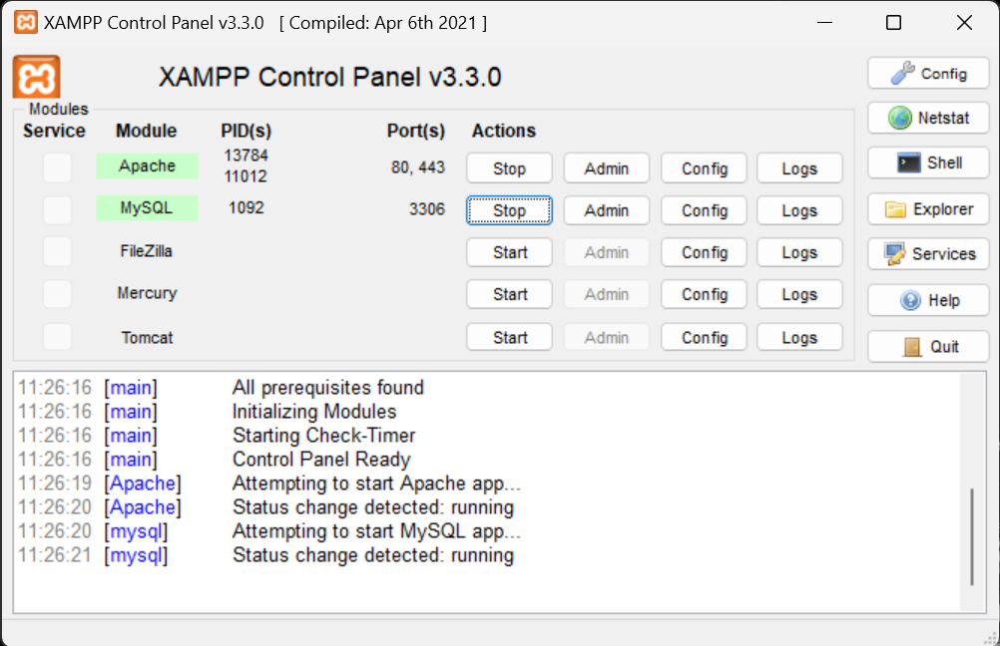
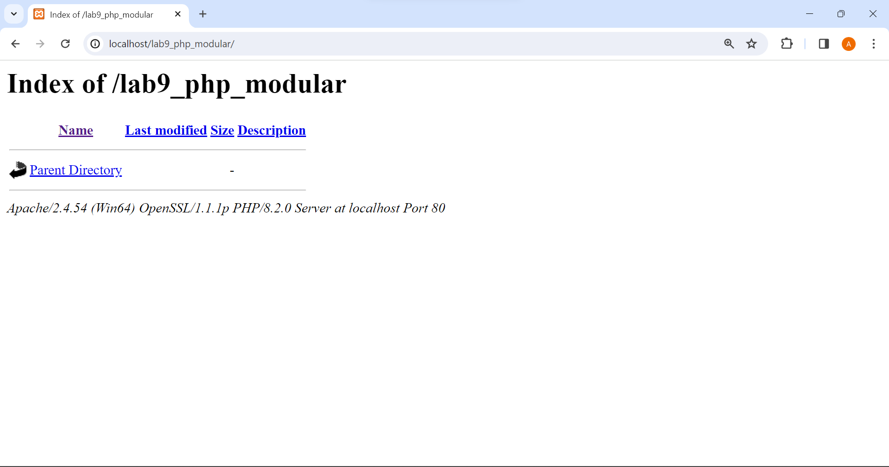
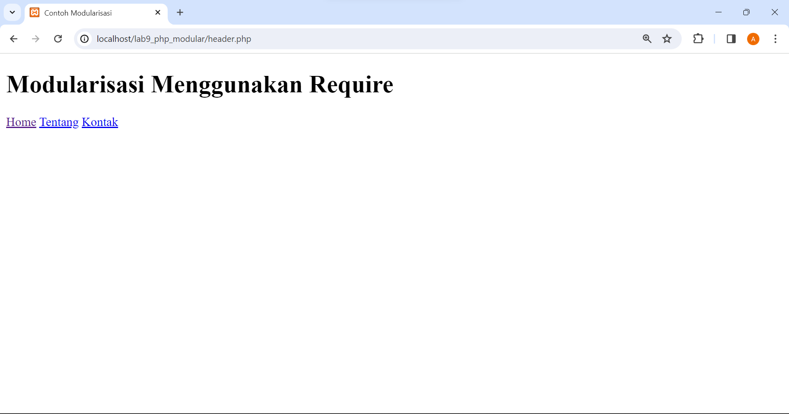
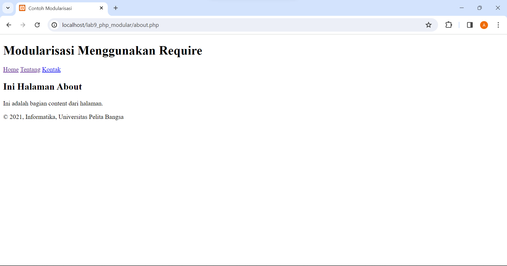
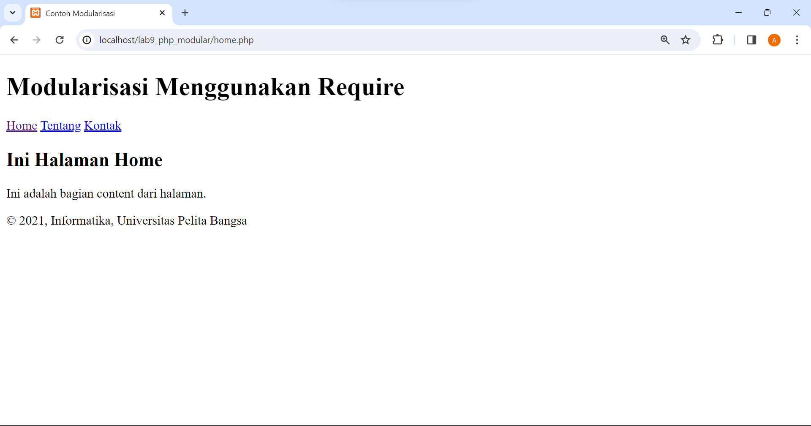
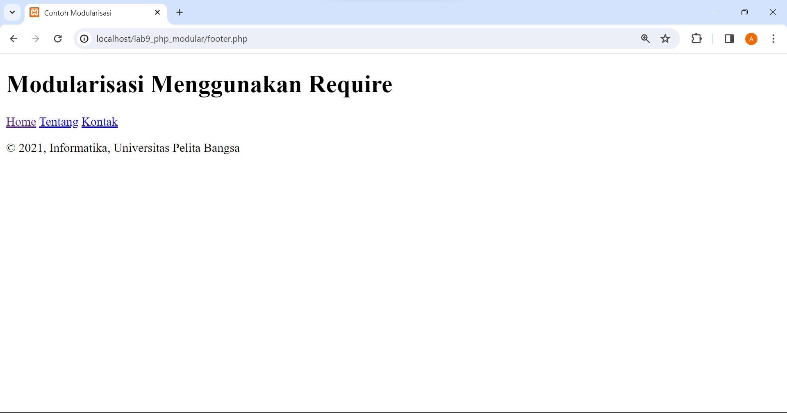
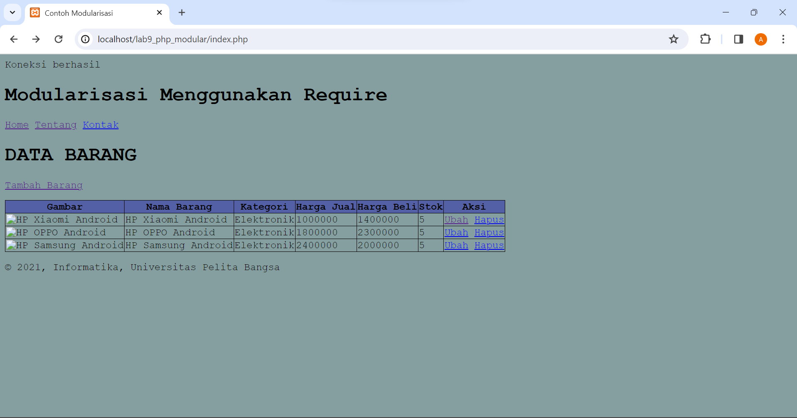
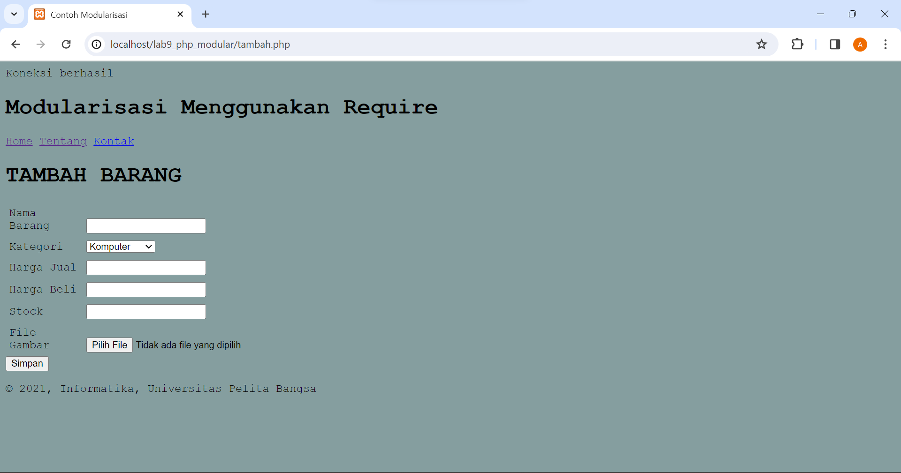
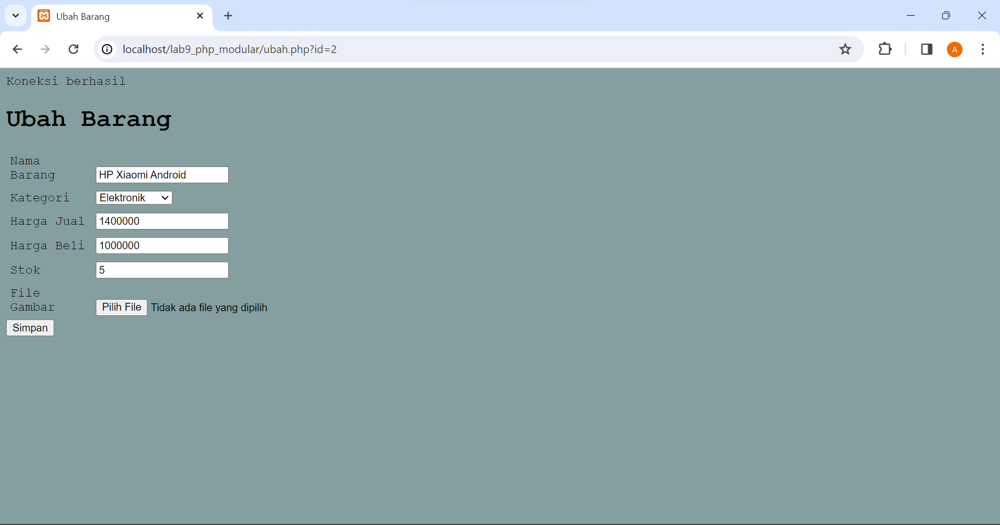

# Lab9Web


Afrizal Fajrianto Anggara Sakti (312210449)

Teknik Informatika - UNIVERSITAS PELITA BANGSA
______________________________________________

## MENJALANKAN PROGRAM XAMPP



Pertama, nyalakanlah tombol Apache dan juga MySQL pada xampp agar semua data dan perubahan-perubahan yang terjadi dapat terhubung ke localhost.

## PEMBUATAN FOLDER

Selanjutnya, buatlah folder pada htdocs dengan nama Lab9_php_modular yang dilanjut dengan pengecekan dokumen pada localhost dengan URL : http://localhost:8080/Lab9Web/Lab9_php_modular/ 

Dan jika dokumen dapat terbaca seperti dibawah ini maka artinya sudah berhasil terhubung.



## MEMBUAT FILE HEADER, FOOTER, HOME, DAN ABOUT

Setelah kalian membuat folder diatas, selanjutnya buatlah beberapa file diantaranya yaitu header, footer, home dan juga about pada folder tersebut.



Untuk dapat membuat menu header seperti diatas dibutuhkannya kode berikut:

```html
<!DOCTYPE html>
<html lang="en">

<head>
    <meta charset="UTF-8">
    <title>Contoh Modularisasi</title>
    <link href="style.css" rel="stylesheet" type="text/stylesheet" media="screen" />
</head>

<body>
    <div class="container">
        <header>
            <h1>Modularisasi Menggunakan Require</h1>
        </header>
        <nav>
            <a href="index.php">Home</a>
            <a href="about.php">Tentang</a>
            <a href="kontak.php">Kontak</a>
        </nav>
```

Selanjutnya jika kalian klik pada tombol About maka akan muncul tampilan seperti ini:



Untuk membuatnya kalian memerlukan kode berikut:

```php
<?php require('header.php'); ?>
<div class="content">
    <h2>Ini Halaman About</h2>
    <p>Ini adalah bagian content dari halaman.</p>
</div>
<?php require('footer.php'); ?>
```

Pada bagian home yang jika kalian klik akan muncul tampilan seperti ini:



Untuk membuatnya dibutuhkan kode berikut:

```php
<?php require('header.php'); ?>
<div class="content">
    <h2>Ini Halaman Home</h2>
    <p>Ini adalah bagian content dari halaman.</p>
</div>
<?php require('footer.php'); ?>
```

Terakhir yaitu membuat footer dengan terdapat seperti gambar di atas dan code di bawah.



Untuk membuatnya dibutuhkan kode berikut:

```html
        <footer>
            <p>&copy; 2021, Informatika, Universitas Pelita Bangsa</p>
        </footer>
    </div>
</body>
</html>
```

# PERTANYAAN DAN TUGAS

Implementasikan konsep modularisasi pada kode program praktikum 8 tentang database, sehingga setiap halamannya memiliki template tampilan yang sama.

## HASIL RUN PADA HALAMAN HOME



## HASIL RUN PADA HALAMAN TAMBAH BARANG



## HASIL RUN PADA HALAMAN UBAH BARANG



SELESAI.

